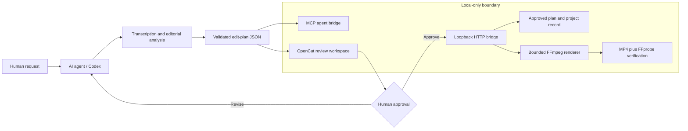

# OpenCut AI-Agent Extension Project Report

**Status date:** 22 July 2026
**Fork:** [Laksh-star/OpenCut](https://github.com/Laksh-star/OpenCut)
**Upstream:** [OpenCut-app/OpenCut](https://github.com/OpenCut-app/OpenCut)
**Working branch:** `codex/agent-bridge-mvp`
**Branch status:** rebased onto latest `upstream/main` and pushed to `origin/codex/agent-bridge-mvp`

## 1. Executive summary

We extended the OpenCut rewrite with a working, local-first path from an AI agent's edit decision to a human-reviewed, rendered MP4.

The fork now contains:

- an MCP server that lets agents inspect local media, validate/save/upgrade structured edit plans, build word-timed captions, compile FFmpeg filter graphs, and render previews;
- a browser-based OpenCut review workspace for revising an agent plan, comparing candidates, recording reviewer notes, previewing the current revision, and separately approving the final render;
- opaque, persistent candidate-review sessions that compare multiple isolated edits without putting plan JSON in the URL;
- HTTP byte-range streaming for multi-gigabyte local sources, so the reviewer no longer reselects the file in the browser;
- a loopback-only HTTP bridge that connects the review UI to the renderer;
- immutable plan revisions, append-only review events, and persistent approval/project records with SHA-256 provenance;
- a backward-compatible v2 production plan with z-ordered video overlays, independently timed/mixed audio, speech-keyed music ducking, transitions, title cards, and styled burned-in captions;
- backend-enforced preflight checks before preview, final, batch, and export actions;
- reusable production presets for caption/title/transition/ducking treatment;
- candidate strategy/rationale metadata, per-clip rationale, and a clearer five-step review workflow in the UI;
- local export packages that bundle rendered MP4s, approved plans, project records, captions, contact sheets, a manifest, and a summary without copying the original large source video;
- a one-command setup packager that emits workspace-scoped environment, Codex MCP, and machine-readable setup files;
- a repo-local user guide that explains what OpenCut controls versus what Codex/agent workflows author;
- automated schema, path-security, rendering, project-persistence, and web-model tests;
- a completed real-video demonstration using the 1986 Swami Ranganathananda interview;
- a private Sites visualization explaining the complete behind-the-scenes workflow.

This is a real MVP seam around the OpenCut rewrite. It does not claim that OpenCut's future native Editor API, MCP server, or headless renderer is already complete. The current render adapter is deliberately isolated behind an edit-plan contract so it can later be replaced by OpenCut-native capabilities.

## 2. What we started with

OpenCut is in the middle of a ground-up rewrite. Its roadmap includes a native Editor API, third-party plugins, an MCP server, headless rendering, and a scripting surface, but those pieces are not yet available as a complete agent workflow.

We therefore used the fork to prove the workflow and contract now:

1. Let an agent inspect and understand source media.
2. Have the agent propose a declarative, portable edit plan.
3. Present the plan and source video to a human inside an OpenCut-branded review workspace.
4. Require explicit approval before rendering.
5. Persist the approved plan and project state.
6. Render locally without uploading or publishing the media.
7. Verify and deliver the resulting clip.

## 3. Repository and Git work

The fork is configured with two remotes:

- `origin` points to `Laksh-star/OpenCut`;
- `upstream` points to `OpenCut-app/OpenCut`.

On 19 July 2026, before continuing feature development, the feature branch was
rebased onto the latest `upstream/main`. Upstream had one new commit since the
previous fork base:

- `5e0696bc` — `fix(tooling): set bun as javascript package manager so moon auto-installs deps`

The rebase completed without conflicts. It aligned `.moon/toolchains.yml` with
upstream, preserved the OpenCut agent bridge changes, and the branch was pushed
back to `Laksh-star/OpenCut` with `--force-with-lease`. After the push, local
`codex/agent-bridge-mvp` and `origin/codex/agent-bridge-mvp` were in sync. The
only local noise left uncommitted was an unrelated `.DS_Store`.

The rebased implementation stack is:

| Commit | Change | Result |
| --- | --- | --- |
| `1862367c` | Add OpenCut MCP agent bridge | Introduced the schema, MCP tools, safe filesystem layer, FFmpeg compiler/renderer, tests, examples, and documentation. |
| `4689a2ed` | Add agent edit plan review workspace | Replaced the placeholder web page with a visual plan-review experience backed by the shared bridge schema. |
| `8d781ed0` | Connect plan approval to local rendering | Added the local HTTP approval bridge, project persistence, approval UI states, and end-to-end approval/render smoke coverage. |
| `1344a508` | Add interactive review playback controls | Added URL plan loading, source-accurate playback, seek/scrub controls, caption parsing, and caption overlays. |
| `b8198fce` | Add candidate review sessions | Added opaque multi-candidate session manifests and a safer review URL handoff. |
| `e637970f` | Add revisioned review and preview approval gates | Added immutable revisions, reviewer notes, event history, preview gating, and output provenance. |
| `35d65275` | Add multitrack edit plans and setup packager | Added v2 overlays/audio schema, upgrade helpers, and workspace-scoped setup artifacts. |
| `c5e7fac9` | Add production finishing features | Added transitions, title cards, styled captions, smart ducking, and production render coverage. |
| `d2ca729e` | Add batch review and production controls | Added batch render approval plus editable v2 production controls in the review UI. |
| `ad2f3319` | Add preflight and export handoff | Added backend preflight enforcement, production presets, export packages, MCP exposure, and expanded tests/smokes. |
| `2026-07-22 UX/rationale pass` | Clarify review workflow and candidate intent | Adds candidate strategy/rationale metadata, per-clip rationale validation, a five-step review panel, candidate intent cards, a user guide, and updated skill instructions for distinct-moment candidate generation. |

This report may be followed by documentation-only commits. Exact branch totals
should be read from Git rather than treated as a fixed figure in this cumulative
report.

## 4. Architecture delivered

### 4.1 Declarative edit-plan contract

The original version-1 schema defines:

- project name, width, height, frame rate, and background;
- video and caption assets;
- sequential clips with source in/out points;
- per-clip speed, volume, and audio inclusion;
- optional SRT/VTT captions;
- MP4 output path and overwrite behavior.

Validation rejects duplicate IDs, missing assets, caption/video type mismatches, invalid clip ranges, unsupported output formats, and unsafe values. The web UI imports the same schema directly, avoiding a second incompatible plan model.

The backward-compatible version-2 schema preserves that primary sequential
A-roll and adds:

- z-ordered overlay tracks with output-timeline start, position, size, opacity, fit mode, and optional source audio;
- independent audio tracks whose clips have their own start, trim, speed, and volume;
- audio-track roles plus configurable speech-keyed ducking for music beds;
- validated transitions between adjacent A-roll clips;
- timed `intro`, `outro`, and `lower-third` title-card templates;
- selectable, burned-in, or dual caption modes with clean, bold, and minimal style presets;
- audio assets in addition to video and caption assets;
- duplicate track/clip validation, canvas-bound checks, same-track overlap rejection, and duration calculation across every layer;
- a deterministic v1-to-v2 upgrade helper and MCP tool.

### 4.2 MCP agent bridge

The new `apps/agent-bridge` package exposes eleven tools:

1. `opencut_capabilities`
2. `opencut_inspect_media`
3. `opencut_validate_edit_plan`
4. `opencut_upgrade_edit_plan`
5. `opencut_save_edit_plan`
6. `opencut_compile_edit_plan`
7. `opencut_render_preview`
8. `opencut_build_word_timed_captions`
9. `opencut_preflight_review_session`
10. `opencut_approve_and_render_project`
11. `opencut_create_export_package`

The agent can inspect media with FFprobe, calculate layered output duration, upgrade v1 plans to v2 without losing the primary timeline, atomically save a plan, convert provider-independent word timestamps into speaker-aware SRT cues, inspect the exact shell-free FFmpeg argument list, render a bounded preview, preflight a saved review session before gated actions, persist and render an explicitly approved project, or package rendered candidates for local handoff.

### 4.3 Safe local execution boundary

The bridge was designed as a constrained local adapter:

- every input and output must remain inside `OPENCUT_AGENT_ROOT`;
- parent traversal and symlink escapes are rejected;
- referenced input files must exist; safe nested output directories are created inside the configured root;
- FFmpeg is launched directly without a shell;
- preview/render duration is capped at five minutes;
- process output is bounded;
- only MP4 output is supported in this MVP;
- no upload or publishing operation exists.

The new `opencut-setup` command resolves the workspace root and emits a private
environment file, Codex MCP TOML snippet, and setup manifest inside that root.
It refuses escaping output paths and deliberately does not mutate global Codex
configuration.

### 4.4 FFmpeg compilation and rendering

The compiler converts sequential plan clips into deterministic FFmpeg arguments. It supports:

- source trimming;
- clip speed changes for video and audio;
- volume control;
- generated silence when clip audio is disabled;
- fit-and-pad reframing to the project canvas;
- target frame-rate normalization;
- sequential audio/video concatenation;
- optional captions muxed as `mov_text`;
- v2 video overlays ordered by track z-index and positioned on the project canvas;
- v2 audio from video overlays plus dedicated audio tracks mixed with `amix`;
- speech-keyed music ducking through `sidechaincompress` while primary dialogue remains uncompressed;
- adjacent video/audio transitions through `xfade` and `acrossfade`;
- locally rasterized title-card and SRT cue graphics composed with `overlay`, without depending on optional FFmpeg text filters;
- caption modes that preserve a selectable `mov_text` stream, burn styling into the picture, or provide both;
- explicit output-timeline delays and duration extension for layered media;
- H.264 video, AAC audio, and fast-start MP4 output.

The FFmpeg adapter is an implementation detail behind the plan contract. It is intended to be swapped for OpenCut's native editor/headless renderer when those APIs are ready.

### 4.5 OpenCut agent review workspace

The web app now presents a usable review boundary rather than a placeholder page. It can:

- load the real sample plan by default;
- import another bridge-compatible JSON plan;
- attach a local video through a browser object URL, without uploading it;
- display project media, captions, project settings, and output duration;
- map source clips onto a sequential output timeline;
- select a clip, seek to its exact source in-point, and stop at its out-point;
- show speed, volume, source range, and clip duration;
- edit source in/out points, clip order, speed, volume, and caption inclusion;
- identify v2 candidates, layered clip totals, overlay/audio track counts, transitions, title cards, caption treatment, ducking, and audio assets;
- show the candidate intent through explicit strategy labels such as `distinct-moment`, `narrative-segment`, or `social-variant`;
- display agent-authored rationale for why a candidate exists and why a selected source clip was used;
- guide the reviewer through the concrete five-step path: select, save, preview, approve, and export;
- apply production presets across caption styling, title colors, transition treatment, and ducking;
- save immutable numbered plan revisions and invalidate stale previews after an edit;
- display backend preflight results for the active saved revision before preview or final approval;
- record reviewer notes and show the append-only review audit trail;
- download the unchanged plan for handoff;
- detect whether the local render bridge is online;
- render a fast revision-specific preview before final approval is available;
- show review, previewing, preview-ready, rendering, rendered, retry, and failure states;
- send the current previewed revision to the high-quality final renderer through **Approve final**.
- create a local export package for rendered candidates.

Primary A-roll controls remain editable for both schema versions. Overlay and
audio tracks are agent-authored, and their existing renderer-backed fields are
editable in the v2 review surface. The compiled preview remains the approval
artifact for the complete layered plan.

### 4.6 Approval, persistence, and local HTTP bridge

The new HTTP bridge binds to `127.0.0.1:3210` and provides:

- `GET /health` for bridge status;
- `POST /v1/projects/approve-and-render` for approval-triggered rendering;
- a default allowlist limited to the local OpenCut development origins;
- a 2 MB request-body cap;
- one approval render at a time;
- schema validation before any file or render operation.

On approval, the service atomically writes:

- `approved-edit-plan.json` — the exact approved plan;
- `opencut.project.json` — project identity, approval source/time, render state, output path, duration, completion time, or failure details.

The record transitions through `rendering` to either `rendered` or `failed`, giving later OpenCut integrations a durable project-level handoff.

### 4.7 Operational stabilization and candidate review sessions

The fork now supports a complete candidate-review session rather than a long
`?plan=<json>` handoff:

- an agent writes `review-session.json` plus one plan per isolated candidate;
- the bridge registers the manifest and returns an opaque, process-local session ID;
- the browser receives only `?session=<id>` and restores state from the bridge;
- candidate cards expose title, summary, duration, clip count, and status;
- candidate cards also expose strategy/rationale metadata so the reviewer can tell whether the agent proposed three different source moments, one narrative split into hook/body/close, or format variants of the same moment;
- selecting a candidate persists the choice but does not authorize rendering;
- edits create immutable `revisions/revision-N.edit-plan.json` snapshots;
- the preview uses a fast `ultrafast`/CRF 32 profile and is tied to the candidate revision;
- final approval is disabled until the current revision has a successful preview;
- final rendering uses a separate `medium`/CRF 20 profile and a session approval token;
- reviewer notes, revision metadata, and selection/preview/approval/render events are persisted in the session manifest;
- `GET`/`HEAD` media requests support HTTP byte ranges and authorize only assets listed in the session;
- caption requests are tied to a candidate plan rather than accepting an arbitrary session path;
- existing output files are detected and shown as rendered after refresh;
- approved plan, project record, preview/final MP4s, and provenance hashes remain inside the selected candidate directory;
- missing nested output directories are created only after their nearest existing ancestor is verified inside `OPENCUT_AGENT_ROOT`;
- `opencut-review <review-session.json>` starts the bridge and web UI and prints the short review URL.

The legacy single-plan import path remains available for compatibility, but the
session flow is now the recommended operational path for large real videos.

### 4.8 Batch approval and editable production controls

The review session has been extended from single-candidate final approval to a
small production queue:

- preview-approved candidates can be added to a separate batch selection without
  changing the active review selection;
- the reviewer must press **Approve batch** before any final renders start;
- the bridge renders candidates sequentially under the existing local render
  lock;
- each batch item persists `queued`, `rendering`, `rendered`, or `failed` state
  inside `review-session.json`;
- the batch itself persists `queued`, `rendering`, `completed`, `partial`, or
  `failed` state and can be polled through the regular session endpoint;
- failed candidates can be reselected for a retry without rerendering successful
  items;
- batch approval, per-candidate final approval/render/failure, and batch
  completion are appended to the audit trail.

The v2 review inspector is also no longer read-only for production layers. It
now exposes form controls for the existing renderer-backed fields: overlay
timing, source range, canvas position/size, opacity, fit, and overlay audio;
audio track role, clip timing, source range, and volume; transition type and
duration; title-card template, text, timing, and colors; caption mode, preset,
alignment, font size, colors, margins, and background opacity; and smart audio
ducking enablement, threshold, ratio, attack, and release. These edits still
save through the immutable revision endpoint and invalidate the previous
preview before final approval can proceed.

### 4.9 Preflight, presets, and export handoff

The July 18 pass turns the review flow from “render after approval” into a
more complete production handoff loop:

- backend preflight checks now inspect saved review-session candidates before
  preview, single final, batch final, or export actions;
- preflight blocks missing assets, busy/rendered candidates where inappropriate,
  stale or missing previews before final render, duplicate final output paths,
  and non-rendered candidates before export;
- preflight warnings surface failed prior actions, render-limit truncation risk,
  and timing issues that should be reviewed but do not necessarily block;
- final and batch endpoints enforce preflight server-side, so the UI cannot
  bypass the safety gate;
- the review UI displays the active candidate's preflight status and explains
  why a preview or final render is blocked;
- three practical production presets apply coordinated caption style,
  transition, title-card color, and ducking changes to existing v2 plans:
  `clean-interview`, `bold-social`, and `minimal-archive`;
- rendered candidates can be packaged through a token-gated local export action;
- export packages are written under `exports/` beside the review manifest and
  include copied rendered MP4s, approved edit plans, project records, captions,
  generated contact sheets when FFmpeg can create them, `manifest.json`, and
  `summary.md`;
- export package metadata is persisted in `review-session.json` and the audit
  trail records `export-package-created`;
- the original source video is not copied into export packages.

## 5. Real-video demonstration completed

### 5.1 Source and transcription

We tested the workflow with **“Swami Ranganathananda on the Ray Martin Show - 1986”** rather than synthetic sample media.

The local source was copied into the video workspace and inspected:

- source duration: `733.216508` seconds (about 12 minutes 13 seconds);
- source size: `36,269,372` bytes;
- primary transcription: 13 one-minute chunks;
- focused refinement pass: 9 shorter chunks covering the editorial area;
- combined transcript: approximately 1,815 words;
- transcription service: OpenRouter audio transcription using `openai/whisper-large-v3`;
- recorded primary transcription cost: approximately `$0.0183`;
- recorded refinement cost: approximately `$0.00224`.

No API key is stored in the project artifacts or this report.

### 5.2 Editorial concept and edit plan

The chosen short-form concept was **“The Matchstick Within”**, built around the analogy that human potential is like fire hidden in a matchstick.

The agent selected two source ranges:

| Clip | Source range | Speed | Purpose |
| --- | --- | --- | --- |
| `fire-analogy` | `595s–625s` | `1.15x` | Establish the matchstick/fire analogy and the need to “strike” it. |
| `human-potential` | `628s–668s` | `1.15x` | Connect the analogy to training the mind and unfolding human potential. |

The plan targets 1280×720 at 25 fps, retains the source audio, and includes a curated eight-cue caption track.

### 5.3 Review and approval

The plan and source video were loaded into the OpenCut review workspace. The timeline, source points, playback, speed, volume, captions, and projected output duration were reviewed visually.

The plan was then approved through the UI. The local bridge recorded the approval source as `web-review`, saved the approved plan, created the project record, and launched the local render.

### 5.4 Rendered output

The completed MP4 was verified with FFprobe:

- status: `rendered`;
- duration: `60.880000` seconds;
- video: H.264, 1280×720, 25 fps;
- audio: AAC;
- subtitles: `mov_text`;
- size: `4,180,105` bytes;
- average bitrate: `549,291` bits/s;
- SHA-256: `daa23f007dee243f91bc1aaa9b15c041d5d22d5adb1201ff8bce48be19f0d669`.

Contact sheets were also created for the selected source section and the final output to support quick visual QA.

## 6. Local artifacts and source-control boundaries

The work is intentionally split across three local areas:

| Area | Purpose | Git status |
| --- | --- | --- |
| `OpenCut/` | Fork source code, tests, and documentation | Feature branch pushed to `Laksh-star/OpenCut`. |
| `../projects/ranganathananda-highlight/` | Source media, transcripts, captions, plans, project record, contact sheets, and final render | Local workspace artifacts; not committed to the fork. |
| `../opencut-workflow-site/` | Standalone workflow-explainer site | Separately versioned and deployed through Sites. |

Keeping the source video and generated media outside the fork avoids committing large media files or potentially sensitive local project material to GitHub.

## 7. Published workflow explainer

A standalone behind-the-scenes visualization was created and then updated to reflect the completed implementation rather than the earlier planned state. It now explains the 13-stage flow from request and consent through transcription, agent decisions, candidate rationale, OpenCut review, production presets, preflight, approval, persistence, rendering, export handoff, and verification.

Production URL: [OpenCut behind the scenes](https://opencut-behind-the-scenes.lakshyindy.chatgpt.site)

The Sites project is currently private and owner-only. The published page preserves a sandboxed iframe and content-security policies in both the outer document and embedded visualization.

## 8. Verification record

The automated verification suite was rerun after the 22 July 2026
review-clarity pass using the repo-local Bun 1.3.11 executable and local web
tool shims. The browser-workflow and real-output rows below are retained from
the earlier implementation verification because this pass changed schema,
review UI, docs, the reusable skill, and the workflow explainer, not the
generated real-media artifacts.

| Check | Result |
| --- | --- |
| Upstream rebase audit | **Pass:** branch rebased cleanly onto `upstream/main` at `5e0696bc`; local and `origin/codex/agent-bridge-mvp` were in sync after push; no feature-file conflicts were predicted or observed. |
| Review-clarity schema/UI pass | **Pass:** candidate strategy/rationale defaults parse, per-clip rationale references are validated against real plan clip IDs, candidate cards show intent, the selected-clip inspector explains why the clip was used, and the UI exposes a five-step select-save-preview-approve-export guide. |
| Agent bridge unit tests | **Pass:** 31 tests across v1/v2 schema migration, overlays, ducked audio, transitions, production graphics, setup packaging, FFmpeg profiles, timed-caption grouping, byte ranges, path security, project paths, immutable revisions, review events, candidate isolation, candidate rationale validation, batch metadata persistence, preflight blockers, and export package creation. |
| Agent bridge TypeScript check | **Pass:** `tsc --noEmit`. |
| Agent bridge build | **Pass:** Bun build generated the Node-target bundle. |
| Approval/render smoke | **Pass:** approved plan and project record persisted; 2-second generated-media MP4 rendered. |
| FFmpeg render smoke | **Pass:** 2-second MP4 rendered; FFmpeg exited successfully. |
| Review-session HTTP smoke | **Pass:** opaque registration, authorized 100-byte range, session captions, two candidate selections, two revision-specific previews, batch preflight, one explicit batch approval, two final renders, SHA-256 provenance, persisted batch state, export package creation, and audit state. |
| Web model tests | **Pass:** 11 tests covering shared-schema parsing, layered track summaries, timeline editing/reordering, v2 production-control helpers, production presets, captions, preview gates, and session helpers. |
| Web TypeScript check | **Pass:** `tsc --noEmit`. |
| Web production build | **Pass:** Vite client and server builds completed. |
| Workflow site validation | **Pass:** `npm test` rebuilt the Sites project, verified the root redirect, preserved the sandboxed iframe/CSP shell, confirmed the 13-stage workflow, and asserted the new candidate-rationale, subtitle-provider, five-step workflow, and WYSIWYG-next-pass copy. |
| Browser workflow | **Pass:** a local v2 review session displayed editable overlay, audio mix, transition, title-card, caption-style, and ducking controls; both preview-ready candidates were added to the batch queue; **Approve batch** rendered both candidates to `rendered`; browser logs contained zero warnings/errors. |
| Production render smoke | **Pass:** generated A-roll, B-roll, music, SRT captions, a crossfade, intro/outro cards, burned captions, selectable captions, and speech-keyed ducking produced a 4.5-second H.264/AAC/`mov_text` MP4; five extracted frames visually confirmed the title and caption overlays. |
| Setup packager smoke | **Pass:** workspace-scoped environment, Codex MCP TOML, and setup manifest generated; escaping output rejected. |
| Real output inspection | **Pass:** FFprobe confirmed the expected video, audio, subtitle, duration, resolution, and frame rate. |
| MCP tool-list smoke | **Pass:** all eleven MCP tools are listed, `opencut_capabilities` reports bridge version `0.6.0`, and capability flags include batch rendering, production-layer editing, preflight checks, and export packages. |
| Reusable skill validation | **Pass:** `opencut-producer` OpenAI metadata parses with Ruby YAML; bundled session validator accepts a synthetic manifest containing `strategy`, `rationale`, and `clipRationales`. Older local saved sessions failed validation only because their referenced local source media was missing, which is the expected safety behavior. |

## 9. What each component is responsible for

### AI agent / Codex

- understands the human request;
- inspects or transcribes the source;
- finds candidate moments and develops the editorial concept;
- creates the declarative edit plan and captions;
- invokes bridge tools and explains the proposed edit;
- produces provider-independent word-timed caption cues when transcript timing is available;
- prepares verification and delivery artifacts;
- can call preflight and export-package tools for saved review sessions.

### OpenCut review workspace

- presents the agent's plan in an editor-like visual context;
- lets the human attach and review local source video;
- exposes and edits exact source ranges, order, speed, volume, captions, timeline behavior, and existing v2 production controls;
- preserves numbered revisions, reviewer notes, and the audit trail;
- requires a successful preview for the current revision before final approval;
- provides explicit single-final and batch approval boundaries;
- displays preflight blockers and warnings for the next gated action;
- triggers local export packages for rendered candidates;
- reports bridge and render state.

### Agent bridge

- validates the shared plan contract;
- enforces the workspace and request safety boundaries;
- inspects media and persists plans/project records;
- compiles deterministic renderer arguments;
- derives speaker-aware SRT cues from timed words;
- records plan/source hashes and agent metadata without storing credentials;
- connects approved single or batch UI actions to local execution;
- enforces preflight checks and creates local handoff packages.

### FFmpeg / FFprobe

- performs the current deterministic media render;
- verifies the actual output container and streams.

### Human reviewer

- supplies or authorizes the local source;
- judges editorial quality and source selection;
- approves or rejects the proposed plan;
- retains control over any future distribution or publishing.

## 10. Current limitations

The MVP deliberately does not yet provide:

- integration with OpenCut's future native Editor API or Rust media core;
- native OpenCut timeline/project synchronization beyond the new JSON project record;
- general-purpose keyframes, masks, arbitrary effects, or freeform title animation beyond the reusable templates;
- multi-band mixing and advanced audio automation beyond speech-keyed music ducking;
- creating or deleting new overlay/audio tracks directly in the review UI; current controls edit existing agent-authored v2 fields;
- a WYSIWYG canvas for manual visual placement of titles, logos, overlays, opacity, and size; the current UI edits numeric renderer-backed fields and relies on preview renders for visual confirmation;
- formats other than MP4;
- remote rendering, uploading, or social publishing;
- multi-user or remote authentication beyond the loopback-only local boundary and per-process session tokens;
- a first-class subtitle-provider selector in the UI; the current skill guidance distinguishes local Whisper, OpenAI API, OpenRouter, and provided captions, but provider execution remains agent/workflow-driven;
- automatic resolution of transcription errors, provider-specific word extraction, or semantic caption cleanup;
- a GitHub pull request from the feature branch to the fork's `main` branch.

## 11. Recommended next development steps

The July 17–18 stabilization, schema-expansion, batch, and production-handoff
passes completed the original operational phase and the multi-track/filter-graph
foundation:

1. **Editable review controls — complete.** The reviewer can adjust source in/out points, ordering, speed, volume, and caption inclusion. Saving creates immutable numbered revision snapshots and invalidates older previews.
2. **Setup/MCP packager — complete.** `opencut-setup` generates workspace-scoped environment, Codex MCP, and setup-manifest files with path-boundary tests.
3. **Preview versus final-render modes — complete.** Fast `ultrafast`/CRF 32 previews are revision-specific. Final approval remains locked until the current revision has a preview, then uses the separate `medium`/CRF 20 profile.
4. **Improve transcription and caption alignment — foundation complete.** The new provider-independent word-timestamp schema performs speaker-aware cue grouping, gap/sentence segmentation, caption-safe wrapping, and SRT generation. Real-media provider evaluation and semantic cleanup remain future work.
5. **Provenance and revision history — complete.** The workflow records immutable plan revisions, source and plan SHA-256 hashes, optional agent/model metadata, reviewer notes, and append-only selection/preview/approval/render events without storing secrets.
6. **Multi-track schema and filter graph — complete.** V2 adds validated overlay/audio tracks; the renderer compiles positioned overlays and independently delayed/mixed audio while v1 remains supported.
7. **Smart audio ducking — complete.** Music-role tracks can be routed through a configurable sidechain compressor keyed from the primary dialogue while the explicit preview/final gates remain unchanged.
8. **Burned-in captions, transitions, and titles — complete.** SRT cues and reusable title templates are rasterized locally, transitions use native FFmpeg crossfades, and caption mode can remain selectable, burned in, or both.
9. **Batch review and render queue — complete.** Preview-approved candidates can be batch-selected, rendered sequentially, persisted per item, and retried selectively on failure.
10. **Production presets and preflight — complete.** The UI offers coordinated style presets, and the backend enforces preflight before preview, final, batch, and export actions.
11. **Local export package — complete.** Rendered candidates can be bundled into a local handoff package with outputs, metadata, captions, contact sheets, manifest, and summary.
12. **Review clarity and candidate rationale — complete.** The session schema now carries candidate strategy, candidate rationale, and per-clip rationale, and the UI explains the select-save-preview-approve-export path.
13. **Build a WYSIWYG visual adjustment surface.** Replace numeric-only visual edits for titles/logos/overlays with a canvas-like preview surface for position, size, opacity, and safe-area adjustment.
14. **Add a subtitle-provider selector.** Make transcription/caption generation selectable between local Whisper, OpenAI API, OpenRouter, and provided captions, with provider-specific cost/privacy notes before execution.
15. **Formalize the native project adapter.** Map the current plan/project record into OpenCut's Editor API when that upstream contract is stable.
16. **Add track creation/deletion and keyframes.** The reviewer can edit existing v2 layers today; adding new layers and keyframed motion/effects would move the UI closer to a true OpenCut-native editor.
17. **Add publication as a separate gated workflow.** Keep export/publishing out of the renderer and require an independent destination-specific approval.
18. **Open a pull request when ready.** Review the cumulative branch as one coherent local-first agent workflow before merging into the fork's `main` branch.

## 12. Overall outcome

We moved from “How could AI agents use OpenCut?” to a functioning local proof:

> A human requests a clip, the agent analyzes real media and proposes a structured edit, OpenCut provides the review and approval surface, the bridge persists the decision, and a bounded renderer creates a verifiable MP4 without uploading or publishing the source.

The most important architectural result is not the single sample clip. It is the reusable contract and approval boundary connecting agent reasoning to OpenCut-controlled execution.
