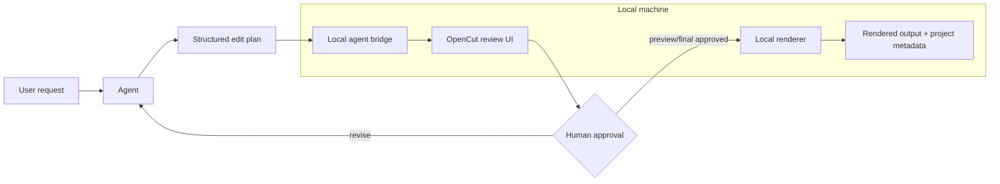

# RFC: Local-first agent bridge and approval workflow

## Status

Proposal. This document sketches a small, reviewable path toward the rewrite
roadmap items around an Editor API, MCP server, headless mode, and scripting.

The intent is not to merge a full AI editing implementation in one step. The
intent is to agree on the boundaries that would let agents assist editing
without bypassing OpenCut or surprising the user.

## Problem

AI agents can already inspect media, transcribe speech, identify highlights,
draft captions, and propose edits. Without an explicit OpenCut integration
boundary, those agents tend to either:

- produce loose instructions that a human must manually rebuild in the editor;
- generate one-off FFmpeg commands that are not represented as OpenCut projects;
- upload media to services unnecessarily; or
- skip human review and approval boundaries.

OpenCut can provide the safer control plane: local media stays local, the editor
shows the proposed edit, the user reviews it, and rendering/export only happens
after explicit approval.

## Goals

- Define a local-first bridge between an agent and OpenCut.
- Keep the human reviewer in control of selection, preview, final render, and
  publication.
- Make agent-authored edits portable through a structured edit-plan contract.
- Support large local source media without copying it into Git or uploading it.
- Leave room for the current adapter to be replaced by OpenCut's native Editor
  API and headless renderer.
- Make the first upstream contribution small enough to review independently of a
  full implementation.

## Non-goals

- No autonomous publishing.
- No remote rendering requirement.
- No credential storage in project files.
- No requirement that the first version cover every OpenCut timeline feature.
- No attempt to make FFmpeg the long-term source of truth for OpenCut projects.

## Proposed architecture

## Edit-plan contract

The bridge should accept a declarative edit plan rather than arbitrary shell
commands. A minimal first contract can cover:

- project canvas, frame rate, and background;
- local media assets referenced by path or project asset ID;
- primary timeline clips with source in/out, speed, volume, and audio inclusion;
- captions as SRT/VTT or timed caption cues;
- output intent without authorizing final render by itself.

A later contract can extend this with:

- overlay tracks;
- independent audio tracks;
- transitions;
- title/lower-third templates;
- caption styling;
- smart music ducking;
- keyframes;
- export-package metadata.

The contract should be versioned so older plans can be upgraded without losing
the primary A-roll timeline.

## Review-session model

Agents should create candidates, not final outputs. A review session can contain:

- one or more isolated candidate plans;
- source asset references authorized for that session;
- selected candidate ID;
- reviewer notes;
- immutable revisions;
- preview status for the current revision;
- final render status;
- audit events;
- optional export-package metadata.

The browser URL should use an opaque session ID rather than embedding a full
plan in the query string.

## Approval gates

Recommended gates:

1. Agent proposes candidates.
2. User selects a candidate.
3. User previews the exact current revision.
4. User approves a single final render or an explicit batch render.
5. User separately approves any publication destination.

Final rendering should be blocked if the current revision has not successfully
previewed.

## Local safety boundary

The bridge should be deliberately constrained:

- bind only to loopback by default;
- restrict all file access to an explicit workspace root;
- reject parent traversal and symlink escapes;
- launch media tools without a shell;
- cap preview/render duration for early versions;
- avoid accepting arbitrary command strings from agents;
- keep upload and publishing out of the render path.

## Preflight checks

Before preview, final render, batch render, or export, the backend should check:

- referenced assets exist;
- source ranges are valid;
- output paths are unique and inside the workspace;
- selected candidates are in the right state;
- final render has a current successful preview;
- rendered outputs exist before export.

The UI can surface warnings separately from hard blockers.

## How this fits the OpenCut rewrite

This proposal does not require the first version of OpenCut's native Editor API
or renderer to be complete. It can start as a local adapter and migrate inward:

1. Document the contract and approval model.
2. Add an experimental bridge package.
3. Connect a review UI to the bridge.
4. Replace the temporary render adapter with OpenCut-native project/render
   primitives when those APIs stabilize.
5. Expose the same contract through MCP, plugins, and scripting.

## Suggested contribution slices

To keep review manageable:

1. RFC/design document only.
2. Experimental edit-plan schema and validation package.
3. Local bridge with media inspection and plan validation only.
4. Review-session UI with no final renderer.
5. Preview/final approval gates.
6. Headless/native renderer integration.
7. Export and publication handoff as separate gated workflows.

## Open questions

- Where should the edit-plan schema live: editor core, plugin API, or bridge
  package?
- Should review sessions be part of the project model or an external workflow
  layer?
- What is the minimum timeline feature set needed before the bridge is useful?
- How should OpenCut represent agent provenance without storing private prompts
  or credentials?
- Which APIs should be stable before external plugins depend on them?
